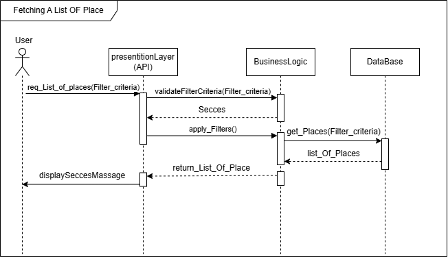

# HBnB Technical Documentation

## 1. Introduction

This document serves as the foundational technical blueprint for the HBnB Evolution application, a simplified architectural clone of AirBnB. The scope of this phase covers the design of the high-level architecture, the detailed modeling of the Business Logic layer, and the step-by-step sequence of key API operations. The goal is to establish clean boundaries between structural responsibilities, apply sound Object-Oriented Programming (OOP) and SOLID principles, and ensure the development phase has a precise design to follow.

---

## 2. System Overview

HBnB Evolution is structured around four primary entities: Users, Places, Reviews, and Amenities. The application allows users to register profiles, host or list properties, write reviews for visited places, and manage searchable amenities. To ensure robustness, maintainability, and loose coupling, the application utilizes a strict Layered Architecture unified by a Facade Pattern intercepting presentation-to-logic communication.

---

## 3. System Architecture and Package Design

The HBnB system follows a layered architecture. This means the system is separated into different parts, and each part has a specific job.

The main layers are:

* Presentation Layer
* Business Logic Layer
* Persistence Layer

### 3.1 Presentation Layer

The Presentation Layer is responsible for receiving user requests and returning responses. In this project, it is represented by the API.

Its main responsibilities are:

* Receive requests from users
* Send requests to the Business Logic Layer
* Return success or error responses
* Handle request and response formatting

This layer does not contain the main business rules. Its role is mainly to connect the user with the system logic.

### 3.2 Business Logic Layer

The Business Logic Layer contains the main rules of the HBnB application. It manages the core operations related to users, places, reviews, amenities, and favorites.

Its main responsibilities are:

* Validate user input
* Apply business rules
* Manage user roles and permissions
* Control how entities interact with each other
* Decide when data should be created, updated, deleted, or retrieved

This layer is important because it controls how the application behaves.

### 3.3 Persistence Layer

The Persistence Layer is responsible for storing and retrieving data. It communicates with the database and keeps the data management separate from the rest of the system.

Its main responsibilities are:

* Save new records
* Retrieve existing records
* Update stored data
* Delete data
* Manage database communication

This separation makes the system cleaner because the Business Logic Layer does not need to directly handle database details.
---

## 4. Domain Model Design

The domain model represents the main objects used inside the HBnB application. These objects describe the core data of the system and how each part is connected to the others.

The main domain entities are:

* User
* Place
* Review
* Amenity
* Favorite

Each entity has a clear responsibility. This helps keep the system organized and makes the application easier to understand, update, and maintain.

### 4.1 Main Domain Entities

| Entity   | Description                                           | Main Responsibility                                                                 |
| -------- | ----------------------------------------------------- | ----------------------------------------------------------------------------------- |
| UserRole | Defines the permission level of a user.               | Controls whether the user is a normal user, owner                       |
| Place    | Represents a rental place listed in the system.       | Stores place details such as title, description, price, location, and availability. |
| Review   | Represents feedback written by a user about a place.  | Stores ratings and comments linked to users and places.                             |
| Amenity  | Represents a feature or service available in a place. | Stores services such as Wi-Fi, parking, kitchen, or air conditioning.               |
| Favorite | Represents a saved place.                             | Connects users with places they want to save for later.                             |

### 4.2 Entity Responsibilities

The `User` entity stores personal account information and role data. It is responsible for registration, authentication, profile updates, and user-related actions.

The `Place` entity stores the information of rental places. Each place has an owner, location, price, availability status, and related amenities or reviews.

The `Review` entity stores user feedback. Each review must belong to one user and one place.

The `Amenity` entity stores available features that can be linked to places. A place can have many amenities, and the same amenity can be used by many places.

The `Favorite` entity connects users with places they want to save. It works as a link between the User and Place entities.

### 4.3 Design Rationale

The domain model is designed to keep each entity focused on one main purpose.

The User entity does not need an `isUser` attribute because every object created from the User class is already a user. Also, instead of using `isAdmin` and `isOwner`, the system uses `UserRole` to avoid confusion and make permissions easier to manage.

The Favorite entity is treated as a separate entity because it represents a relationship between a user and a place. This makes it easier to prevent duplicate favorites and to list saved places for each user.

The Amenity entity is separated from Place because the same amenity can be used by many places. This avoids repeated data and keeps the design cleaner.

User Role Design

The system uses a `UserRole` enum instead of multiple Boolean attributes such as`isOwner`, or `isUser`. Using an enum also makes the system easier to expand later. For example, new roles such as `MODERATOR` or `SUPPORT` can be added without changing the whole user structure.

This is a cleaner design because each user has one clear role.

The available roles are:

* `USER`: A normal user who can browse places, write reviews, and save favorite places.
* `OWNER`: A Normal user who can also create and manage their own places.
* `ADMIN`: A user with higher permissions who can manage users, places, reviews, and amenities.

## 5. Entity Relationships

The entities in the HBnB system are connected to each other through clear relationships.

The main relationships are:

* User 1 → 0..* Place
* User 1 → 0-1 Review
* Place 0.1 → 0..* Review
* Place *..1 → 1..* Amenity
* User 1 → 0..* Favorite

### Relationship Explanation

A user can own many places.
A place belongs to one user.

A user can write one review.
A review belongs to one user.

A place can have many reviews.
A review belongs to one place.

A place can have many amenities.
An amenity can be linked to many places.

The Favorite entity works as a connection between User and Place.

The UserRole enum is used by the User entity to define the user’s role.

---

## 6. Business Rules

The HBnB system follows clear business rules to keep the data correct, safe, and organized.

The main business rules are:

* A user must have a unique email.
* A user must have one role from the UserRole enum.
* A normal user can browse places, write reviews, and save favorites.
* An owner can create and manage their own places.
* An admin can manage users, places, reviews, and amenities.
* A place must belong to an existing user.
* A review must belong to an existing user and an existing place.
* A rating should be within the allowed range.
* An amenity can be linked to one place.
* A favorite must connect one user with one place.
* A user should not save the same place as favorite more than once.
* Empty or invalid data should not be accepted.
* Sensitive actions, such as deleting users, should require admin permission.

---

## 7. Sequence Diagrams

The sequence diagrams describe how the main actions happen inside the HBnB system. They show how the user (Actor), Presentation Layer, Business Logic Layer, and Persistence Layer (Database) interact step by step.

These diagrams are important because they explain the flow of requests before implementation. They also help developers understand which layer is responsible for each action.

---

## 7.1 User Registration Sequence Diagram

The user registration sequence explains how a new user creates an account in the HBnB application.

### 7.1.1 Data Flow and Interactions

1- User → Presentation Layer:
The new user enters registration information.

2- Presentation Layer → Business Logic Layer:
The API sends the user data to the Business Logic Layer using a registration request.

3- Business Logic Layer:
The system validates the user data. Like It checks that all required fields are filled.

4- Business Logic Layer → Persistence Layer / Database:
The Business Logic Layer store the new user data to the database if the validation is successful.

5- Database → Business Logic Layer:
The database confirms that the new user was saved successfully.

6- Business Logic Layer → Presentation Layer API:
The Business Logic Layer returns an account creation confirmation to the API.

7- Presentation Layer API → User:
The API displays a success message to the user, such as “Account created successfully.”

### 7.1.2 Explanatory Notes

1- Purpose of the Diagram:
This diagram explains how a new user registers in the HBnB system. It also shows how the system checks user data before creating the account.

2- Key Components Involved:

* User, Presentation Layer(API), Business Logic Layer, Persistence Layer(Database)

3- Design Decisions and Rationale:

* User input is validated before being saved.
* The email must be unique to prevent duplicate accounts.
* The API does not directly communicate with the database.
* The Business Logic Layer controls validation and account creation.
* The database is only used after the data passes validation.

5- How It Fits into the Overall Architecture:
This sequence represents the first entry point for users in the HBnB system. It also shows the responsibility of each layer clearly: the API receives the request, the Business Logic Layer applies the rules, and the database stores the final data.

---

## 7.2 Create Place Sequence Diagram

This sequence shows how an owner creates a new place listing.

### 7.2.1 Data Flow and Interactions

1- Owner → Presentation Layer API:
The owner enters place details such as title, description, price.

2- Presentation Layer API → Business Logic Layer:
The Presentation Layer sends the place data to the Business Logic Layer.

3- Business Logic Layer:
The system validates the data and checks that the user has permission to create a place.

4- Business Logic Layer → Persistence Layer(Database):
If the data is valid, the new place is saved.

5- Persistence Layer(Database) → Business Logic Layer:
The database confirms that the place was created.

6- Business Logic Layer → Presentation Layer → Owner:
A success message is returned to the owner.

### 7.2.2 Explanatory Notes

Purpose:
This diagram explains how a place is created and linked to its owner.

Key Components:
Owner, Presentation Layer(API), Business Logic Layer, Persistence Layer(Database).

Design Decisions:
The system checks user permission before creating the place. This prevents normal users without the correct role from adding listings.

Architecture Fit:
This sequence shows how the Business Logic Layer protects the system rules before storing new listing data.

## 7.3 Create Review Sequence Diagram

This sequence shows how a user writes a review for a place.

### 7.3.1 Data Flow and Interactions

1- User → Presentation Layer:
The user enters a rating and comment for a selected place.

2- Presentation Layer → Business Logic Layer:
The Presentation Layer sends the review data to the Business Logic Layer.

3- Business Logic Layer:
The system checks that the user exists, the place exists, and the rating is within the allowed range.

4- Business Logic Layer → Persistence Layer(Database):
If the review is valid, it is saved in the database.

5- Persistence Layer(Database) → Business Logic Layer:
The database confirms that the review was stored.

6- Business Logic Layer → Presentation Layer API → User:
A success message is returned to the user.

### 7.3.2 Explanatory Notes

Purpose:
This diagram explains how users add feedback to places.

Key Components:
User, Presentation Layer(API), Business Logic Layer, Persistence Layer(Database).

Design Decisions:
The review must be connected to both an existing user and an existing place. The rating must also follow the allowed range.

Architecture Fit:
This sequence supports the review feature while keeping validation inside the Business Logic Layer.

## 7.4 Add Amenity to Place Sequence Diagram

This sequence shows how an amenity is added or linked to a place.

### 7.4.1 Data Flow and Interactions

1- Owner/Admin → Presentation Layer:
The owner or admin selects a place and chooses one or more amenities to add.

2- Presentation Layer → Business Logic Layer:
The Presentation Layer sends the place ID and amenity data to the Business Logic Layer.

3- Business Logic Layer:
The system checks that the place exists, the amenity exists, and the user has permission to update the place.

4- Business Logic Layer → Persistence Layer(Database):
If the request is valid, the amenity is linked to the place.

5- Persistence Layer(Database) → Business Logic Layer:
The database confirms that the amenity was added.

6- Business Logic Layer → Presentation Layer → Owner/Admin:
A success message is returned.

### 7.4.2 Explanatory Notes

Purpose:
This diagram explains how amenities are connected to places.

Key Components:
Owner/Admin, Presentation Layer(API), Business Logic Layer, Persistence Layer(Database).

Design Decisions:
Amenities are handled separately from places because the same amenity can be used by many listings. Permission is checked before updating the place.

Architecture Fit:
This sequence supports the relationship between Place and Amenity while keeping updates controlled by the Business Logic Layer.

## 8. Conclusion

This document explains the main design of the HBnB application. It describes the system architecture, package design, main entities, relationships, user roles, favorite feature, business rules, and sequence diagram flow.

The document will be used as a guide during implementation. It helps developers build the application in a clean, organized, and maintainable way.

